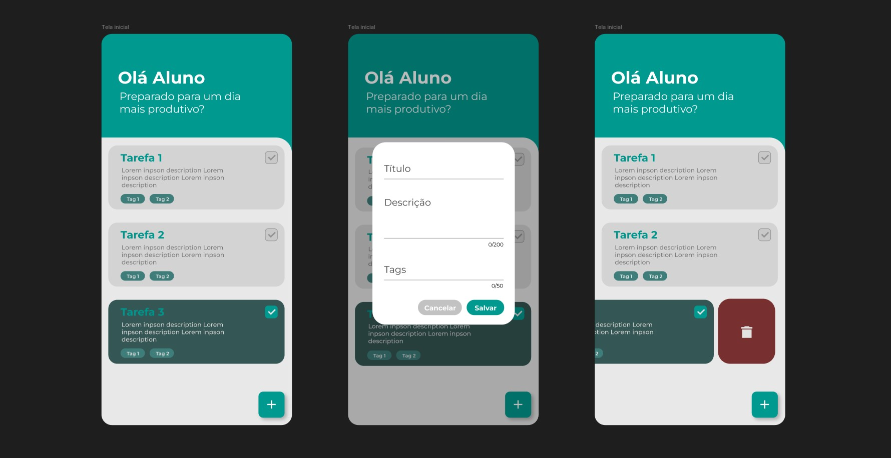

# Todo List App


Este é um aplicativo de lista de tarefas (todo list) desenvolvido com Flutter. O aplicativo foi projetado para ser simples, intuitivo e eficiente, oferecendo uma interface limpa e amigável.

## Funcionalidades

- Adicionar novas tarefas com título, descrição e tags.
- Marcar tarefas como concluídas ou não concluídas.
- Excluir tarefas da lista.
- Interface responsiva que se adapta a diferentes tamanhos de tela.

## Tecnologias Utilizadas

- **Flutter**: Framework de desenvolvimento de interfaces de usuário multiplataforma.
- **Dart**: Linguagem de programação usada para construir o aplicativo.

### Dependências

```yaml
hive: ^2.2.3
hive_flutter: ^1.1.0
hive_generator: ^1.1.3
build_runner: ^2.1.11
flutter_slidable: ^3.1.1
```

## Instalação

1. Clone o repositório:

   ```bash
   git clone https://github.com/seu-usuario/seu-repositorio.git
   ```

2. Navegue até o diretório do projeto:

   ```bash
   cd TodoList
   ```

3. Instale as dependências do Flutter:

   ```bash
   flutter pub get
   ```

4. Execute o aplicativo:
   ```bash
   flutter run
   ```
